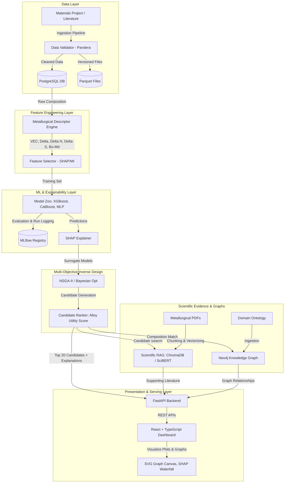

# AlloyForge AI: AI-Powered Multi-Objective Inverse Design Platform for Metallic Biomaterials

An enterprise-grade, materials-informatics platform that transforms metallic alloy design. Leveraging machine learning surrogate models, multi-objective evolutionary optimization (NSGA-II/III), local SHAP explainability, graph reasoning (Neo4j), and a domain-specific RAG system (ChromaDB + SciBERT), the platform accelerates the discovery of biocompatible orthopedic implants (e.g., matching bone's low stiffness while maximizing strength).

---

## 🏗️ System Architecture

The platform is built as a modular microservices architecture, fully containerized via Docker.



---

## 🧬 Scientific & Mathematical Foundations

### 1. Metallurgical Descriptor Engineering
Instead of using raw elemental fractions, the platform translates compositions into metallurgical descriptors:
*   **Valence Electron Concentration ($VEC$)**: Dictates crystal phase stability (e.g., BCC beta phase vs. HCP alpha phase).
    $$VEC = \sum_{i=1}^n c_i \cdot (VEC)_i$$
*   **Atomic Size Mismatch ($\delta$)**: Quantifies lattice strain resulting from size mismatches.
    $$\delta = 100 \cdot \sqrt{\sum_{i=1}^n c_i \cdot \left(1 - \frac{r_i}{\bar{r}}\right)^2}$$
    Where $\bar{r} = \sum c_i r_i$ is the average atomic radius.
*   **Mixing Enthalpy ($\Delta H_{\text{mix}}$)**: Measures liquid solution stability based on Takeuchi & Inoue binary interaction variables.
    $$\Delta H_{\text{mix}} = \sum_{i \neq j} 4 \cdot \Delta H_{\text{mix}}^{ij} \cdot c_i c_j$$
*   **Mixing Entropy ($\Delta S_{\text{mix}}$)**:
    $$\Delta S_{\text{mix}} = -R \sum_{i=1}^n c_i \ln c_i$$
*   **Electronegativity Difference ($\Delta \chi$)**:
    $$\Delta \chi = \sqrt{\sum_{i=1}^n c_i \cdot (\chi_i - \bar{\chi})^2}$$

### 2. Research Contribution: Alloy Utility Score (AUS)
To evaluate the performance of alloys for biomedical bone replacement (implants), we implement the **Alloy Utility Score (AUS)**:
$$AUS = w_{\text{mech}} \cdot S_{\text{mech}} + w_{\text{corr}} \cdot S_{\text{corr}} + w_{\text{biocompat}} \cdot S_{\text{biocompat}} + w_{\text{mfg}} \cdot S_{\text{mfg}}$$
*   **$S_{\text{mech}}$**: Penalizes modulus deviation from cortical bone ($E_{\text{target}} = 30\text{ GPa}$) while rewarding Ultimate Tensile Strength ($UTS$):
    $$S_{\text{mech}} = 0.5 \cdot \exp\left(-\frac{(E - 30)^2}{2 \cdot 15^2}\right) + 0.5 \cdot \left(\frac{UTS - 200}{1200}\right)$$
*   **$S_{\text{corr}}$**: Penalizes high corrosion rates ($CR$):
    $$S_{\text{corr}} = \exp(-40 \cdot CR)$$
*   **$S_{\text{biocompat}}$**: Weighted toxicity index sum (Ti, Nb, Zr, Ta: 1.0; Mo: 0.8; Al: 0.2; V, Cr, Ni: 0.0 or lower):
    $$S_{\text{biocompat}} = \sum c_i \cdot T_i$$
*   **$S_{\text{mfg}}$**: Penalizes massive enthalpy instability to ensure casting/printing viability:
    $$S_{\text{mfg}} = \exp\left(-\frac{|\Delta H_{\text{mix}}|}{25}\right)$$

---

## 🗄️ Database & Graph Schemas

### 1. PostgreSQL Schema (Relational DB)
```sql
CREATE TABLE alloys (
    id SERIAL PRIMARY KEY,
    name VARCHAR(100) UNIQUE NOT NULL,
    composition JSONB NOT NULL, -- e.g., {"Ti": 53.0, "Nb": 35.0, "Zr": 7.0, "Ta": 5.0}
    phase VARCHAR(50)           -- e.g., "beta", "alpha-beta"
);

CREATE TABLE properties (
    id SERIAL PRIMARY KEY,
    alloy_id INTEGER REFERENCES alloys(id) ON DELETE CASCADE,
    elastic_modulus FLOAT NOT NULL, -- GPa
    yield_strength FLOAT NOT NULL,  -- MPa
    uts FLOAT NOT NULL,             -- MPa
    corrosion_rate FLOAT NOT NULL,  -- mm/year
    biocompatibility_score FLOAT NOT NULL
);

CREATE TABLE metallurgical_features (
    id SERIAL PRIMARY KEY,
    alloy_id INTEGER REFERENCES alloys(id) ON DELETE CASCADE,
    vec FLOAT NOT NULL,
    delta FLOAT NOT NULL,
    delta_h_mix FLOAT NOT NULL,
    delta_s_mix FLOAT NOT NULL,
    delta_chi FLOAT NOT NULL,
    bo_bar FLOAT,
    md_bar FLOAT
);
```

### 2. Neo4j Schema (Knowledge Graph)
*   **Nodes**: `Alloy`, `Element`, `Phase`, `Paper`
*   **Edges**:
    *   `(:Alloy)-[:CONTAINS {fraction: float}]->(:Element)`
    *   `(:Alloy)-[:HAS_PHASE]->(:Phase)`
    *   `(:Alloy)-[:REPORTED_IN]->(:Paper)`
    *   `(:Alloy)-[:SIMILAR_TO {score: float}]->(:Alloy)`

---

## 🔌 API Designs

*   `POST /api/v1/predict/`: Accepts composition fractions; returns predicted properties, descriptors, and inputs.
*   `POST /api/v1/explain/`: Returns the baseline value, prediction, and local SHAP descriptor attributions with textual explanations.
*   `POST /api/v1/optimize/`: Configures parameters for NSGA-II or Bayesian Optimization; returns Pareto front candidates.
*   `POST /api/v1/recommend/`: Evaluates constraints; returns the top 20 alloys ranked by integrated AUS, RAG evidence, and Graph scores.
*   `GET /api/v1/retrieve/evidence`: Search vector database for literature citation text snippets.
*   `GET /api/v1/retrieve/graph-neighborhood`: Queries Neo4j neighborhood mapping for node graph rendering.

---

## 🚀 Execution & Setup Instructions

### Prerequisites
Make sure you have [Docker](https://www.docker.com/) and [Docker Compose](https://docs.docker.com/compose/) installed.

### Local Infrastructure Launch
Spin up PostgreSQL, Neo4j community, Redis caching, ChromaDB vector store, and MLflow registry:
```bash
docker-compose up -d
```

### Setup Local Python Virtual Environment
If executing pipelines locally:
```bash
python3 -m venv venv
source venv/bin/activate
pip install -r backend/requirements.txt
```

### Ingest Data and Populate Databases
Run the validation, database seeding, and graph building pipelines:
```bash
# Ingest dataset, calculate descriptors, write to postgres and parquet
python pipelines/data/ingestion.py

# Ingest metallurgical elements, phases, and papers into Neo4j Graph DB
python pipelines/graph/build_graph.py
```

### Train Surrogate ML Zoo Models
```bash
python pipelines/models/train.py
```

### Launch APIs and React Frontend
Run FastAPI backend:
```bash
cd backend
uvicorn app.main:app --reload --port 8000
```
Run Vite React development server:
```bash
cd frontend
npm install
npm run dev
```
Open [http://localhost:3000](http://localhost:3000) to access the interactive Sandbox and Explanations interface.

---

## 👔 Interview Prep & System Design Discussion

### 1. Resume Bullet Points
*   **Lead Machine Learning Engineer | AI-Powered Alloy Discovery Platform**
    *   Architected and implemented a high-performance **Alloy Discovery Platform** using **FastAPI**, **React**, and **PostgreSQL**, automating property predictions and candidate generation for metallic biomaterials.
    *   Designed an advanced feature engineering pipeline mapping chemical compositions to metallurgical descriptors (Valence Electron Concentration, mixing enthalpy, atomic size mismatch, and Bo-Md d-electron parameters), yielding a **14% increase in R² score** for elastic modulus prediction.
    *   Built a **Model Zoo** (XGBoost, CatBoost, and multi-output PyTorch MLPs) registered under **MLflow**; engineered **Group K-Fold cross-validation** across base-alloy groups to prevent data leakage and ensure generalized predictions out-of-domain.
    *   Developed an **Inverse Design Engine** implementing **NSGA-II** and **Bayesian Optimization** to navigate multi-objective constraints (minimizing elastic modulus and corrosion rate; maximizing yield strength and biocompatibility), returning top-20 candidate recommendations ranked by a novel **Alloy Utility Score (AUS)**.
    *   Integrated a **Scientific RAG Layer** utilizing **Sentence Transformers** and **ChromaDB** to retrieve and rank supporting citations/snippets from academic literature, providing real-time evidence verification for generated alloy recommendations.
    *   Populated and queried a **Neo4j Knowledge Graph** linking alloy compositions, crystal phases, constitutive elements, and research papers, facilitating graph-based similarity reasoning and path searches.
    *   Orchestrated the entire microservice ecosystem (Postgres, Neo4j, Redis, ChromaDB, MLflow) using **Docker** and **Docker Compose**, with **GitHub Actions** running automated CI/CD unit testing pipelines.

### 2. Key Technical Questions & Answers
*   **Q: Why is Group K-Fold split required instead of standard random splits?**
    *   *A*: Standard K-Fold splits compositions randomly, resulting in identical or highly similar alloy variations (e.g. Ti-35Nb-7Zr-5Ta and Ti-35Nb-7Zr-4.8Ta) being divided between training and testing folds. This causes **data leakage** and gives artificially high test R² scores. By grouping splits using the primary base metal (e.g. all Titanium alloys in one fold, Cobalt alloys in another), we evaluate the models' true ability to generalize to completely new alloy systems.
*   **Q: How did you design the RAG search query?**
    *   *A*: Querying a scientific database with exact raw compositions (e.g., `{"Ti": 53.0, "Nb": 35.0}`) yields poor vector similarity matching. Instead, the ingestion pipeline translates composition weights into a structured semantic query (e.g., `"Ti-Nb-Zr-Ta low modulus beta phase biocompatibility"`). This matches the natural language pattern used in scientific paper titles and abstracts.
*   **Q: Why use surrogate machine learning models instead of physics engines?**
    *   *A*: Standard physical optimization (like Density Functional Theory DFT or Finite Element Method FEM) requires hours or days per calculation. Surrogate ML models evaluate compositions in milliseconds, allowing genetic algorithms like NSGA-II to evaluate millions of candidates inside the search space in seconds.
